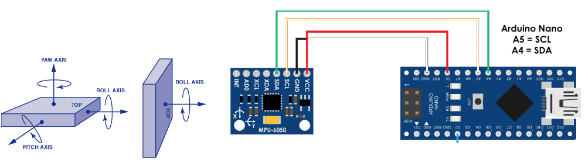

# MPU6050Lite
A bare-bones library for interfacing with the MPU6050 with the Arduino - gives roll and pitch values only

Library by J. French https://github.com/jakefrenchgithub/, released to the public domain
License: MIT, https://opensource.org/licenses/MIT

This is a bare-bones library for interfacing with the MPU6050 Inertia Measurement Unit sensor
The MPU6050 is a 6 DoF (degrees of freedom) or a six-axis IMU sensor, giving 6 output values:
3x DoF for the accelerometer and 3x for the gyroscope, addressed over I2C.
This library only gives accelerometer reading for the roll and pitch values for expediency,
though may be expanded to give gyroscope data.

Typical circuit:

Arduino library installation - add the *.zip file to Arduino IDE

Supporting documentation
MPU6050 Register Map:
https://invensense.tdk.com/wp-content/uploads/2015/02/MPU-6000-Register-Map1.pdf

J. French, 10/7/20